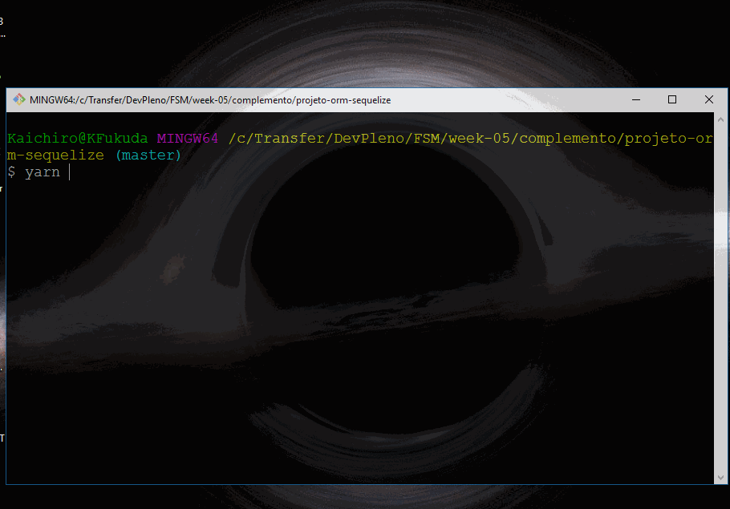

## NodeJS, MySQL e Sequelize

---

Projeto para estudos sobre utilização do NodeJS com MySQL, persistência com Sequelize.




* Clone este projeto

```sh
$ git clone https://github.com/kaichiro/node-mysql-knexjs.git
```

---

##### Configurando o projeto

* Variáveis do projeto

  * O arquivo ```config-db-exemplo.json``` é um exemplo de armazenamento de configuração;
  * Duplique este arquivo ```config-db-exemplo.json```;
  * Renomeie o novo arquivo para ```config-db.json```;

* Modifique as informações deste novo arquivo para as credenciais do banco em questão.

```sh
{
    "database": "álias/nome da base de dado",
    "host": "ip ou nome do host",
    "port": 3306,
    "user": "root",
    "password": "senha do user",
    "dialect": "mysql"
}
```

---

##### Executando o projeto

- No diretório principal do projeto, execute o comando abaixo para instalar as dependências do projeto

```sh
$ yarn
```

- Executar o projeto

```sh
$ yarn start
```

---

[DevPleno - Fullstack Master](https://www.devpleno.com/)